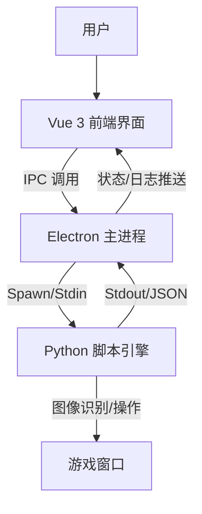

# Duet Night Abyss Automator (DNA-Auto)

这是一个基于 **Electron** + **Vue 3** + **Python** 的自动化游戏辅助工具。它通过现代化的前端界面提供极其便捷的操作体验，底层利用 Python 强大的图像识别能力实现游戏自动化功能。

## ✨ 主要功能 (Features)

1.  **现代化 UI 界面**: 基于 Vue 3 构建，提供流畅的操作体验和可视化配置。
2.  **智能监控**: 内置全局状态机，自动检测游戏窗口存在与状态。
3.  **脚本引擎**: 强大的 Python 后端，支持图像识别 (OpenCV) 和 自动化操作。
4.  **实时日志**: 前端实时展示运行日志，方便调试和监控脚本行为。
5.  **安全隔离**: 基于 Electron 多进程架构，确保脚本运行稳定。

## 🛠 技术栈 (Tech Stack)

| 模块 | 技术选型 | 说明 |
| :--- | :--- | :--- |
| **Shell** | Electron | 跨平台桌面应用容器 |
| **Frontend** | Vue 3, TypeScript, Vite | 高性能 UI 开发 |
| **UI Framework** | Naive UI (拟定) | 现代化的 Vue 3 组件库 |
| **State Mgmt** | Pinia | 全局状态管理 |
| **Backend** | Python 3 | 核心逻辑与图像处理 |
| **Libs** | OpenCV, PyAutoGUI | 图像识别与模拟操作 |

## 🏗 架构设计 (Architecture)



## 🚀 快速开始 (Getting Started)

### 开发环境要求
- Node.js (v18+)
- Python (v3.10+)
- pip (Python 包管理)
- **Windows 管理员权限** (必需)

### ⚠️ 重要提示:管理员权限

**本应用必须以管理员权限运行**,原因:
- 窗口置顶和切换需要管理员权限
- 全局快捷键注册需要管理员权限
- 模拟鼠标和键盘操作需要管理员权限

**启动方式**:
1. **开发模式**: 以管理员身份打开命令行,然后运行 `npm run dev`
2. **快捷启动**: 双击 `以管理员身份运行.bat` (自动请求管理员权限)
3. **自动检测**: 应用启动时会自动检测权限,如果没有管理员权限会提示重启

### 安装依赖

```bash
# 前端依赖
npm install

# Python 依赖
pip install -r py_engine/requirements.txt
```

### 启动开发

**方式1: 命令行启动 (推荐开发时使用)**
```bash
# 以管理员身份打开 PowerShell 或 CMD
# 然后运行:
npm run dev
```

**方式2: 批处理文件启动 (推荐普通用户使用)**
```bash
# 双击运行
以管理员身份运行.bat
```

应用启动后会自动:
- 检测管理员权限
- 如果没有权限,会弹出对话框提示重启
- 启动 Vite 开发服务器
- 启动 Electron 主进程窗口
- 启动 Python 脚本引擎

## 📋 项目状态 (Project Status)

### ✅ 已完成功能
- [x] Electron + Vue 3 基础架构搭建
- [x] Preload 脚本正确配置,实现安全的 IPC 通信
- [x] Python 引擎启动和进程管理
- [x] 前后端数据通信管道(Electron ↔ Python)
- [x] 实时日志显示系统
- [x] 基础 UI 界面(使用 Naive UI)
- [x] 游戏窗口检测功能
- [x] 窗口连接和捕获功能

### 🚧 开发中
- [ ] 图像识别脚本引擎
- [ ] 自动化操作逻辑
- [ ] 配置管理系统

## 🔧 已解决的问题 (Resolved Issues)

### Issue #1: electronAPI 未定义
**问题描述**: 前端调用 `window.electronAPI` 时报错 `undefined`

**根本原因**: 
1. `electron/main.ts` 缺少应用启动代码(`app.whenReady()`)
2. 窗口未被创建,导致 preload 脚本未加载

**解决方案**:
1. 添加 `app.whenReady()` 监听器
2. 在应用就绪时调用 `createWindow()` 和 `startPythonEngine()`
3. 添加必要的 IPC 处理器(如 `ping`)

---

### Issue #2: 后端卡死和窗口检测功能未联调
**问题描述**: 
1. Python后端可能卡死,缺少调试日志
2. 前端重复注册事件监听器导致状态混乱
3. 窗口检测功能前后端未完全联调

**根本原因**:
1. `App.vue` 中重复注册了 `onPythonData` 监听器(第23行和第53行)
2. Python后端缺少详细的日志输出和异常处理
3. Electron主进程的stdout处理可能丢失不完整的JSON数据

**解决方案**:
1. 合并重复的事件监听器为单一监听器,统一处理所有Python数据
2. 在Python后端添加详细的启动日志、命令日志和异常追踪
3. 改进Electron主进程的stdout处理,使用缓冲区处理分块的JSON数据
4. 为所有命令添加try-catch错误处理
5. 将Python的stderr也发送到前端日志显示

---

### Issue #3: 快捷键启动脚本优化和窗口置顶增强
**问题描述**:
1. 按快捷键启动脚本时,如果窗口未连接,没有自动检测窗口功能
2. 窗口置顶功能不够强力,经常失败

**根本原因**:
1. `handleStartScript()` 函数只是提示用户连接窗口,没有自动检测逻辑
2. Python的 `activate_window()` 方法只使用了单一的 `SetForegroundWindow`,Windows对此API有严格限制

**解决方案**:

**前端改进 (src/App.vue)**:
1. 添加 `pendingStartScript` 标志位,用于跟踪"检测窗口后需要启动脚本"的状态
2. 修改 `handleStartScript()`:
   - 如果窗口未连接,自动调用 `autoDetectGameWindow()`
   - 设置 `pendingStartScript = true`
3. 在 `window_set` 事件处理中:
   - 检查 `pendingStartScript` 标志
   - 如果为true,窗口连接成功后自动调用 `handleStartScript()`
4. 增加窗口置顶的延迟时间(200ms → 500ms),确保置顶操作完成

**Python端增强 (py_engine/window_capture.py)**:
1. 改进 `activate_window()` 方法,使用6步组合策略:
   - 步骤1: 检测并还原最小化窗口
   - 步骤2: 显示隐藏的窗口
   - 步骤3: 使用 `BringWindowToTop` 将窗口带到顶部
   - 步骤4: 临时设置为 `HWND_TOPMOST` (置顶)
   - 步骤5: 取消 `TOPMOST` 但保持在前面
   - 步骤6: 尝试3种方法激活前台窗口:
     - 方法A: 直接调用 `SetForegroundWindow`
     - 方法B: 使用 `AttachThreadInput` 绕过Windows限制
     - 方法C: 使用 `Shell.SendKeys` 发送Alt键后再激活
2. 添加详细的日志输出,每一步都有状态反馈
3. 验证窗口是否成功激活到前台

**用户体验改进**:
- 现在按快捷键启动脚本时,会自动检测游戏窗口并连接
- 窗口置顶成功率大幅提高
- 详细的日志输出方便调试问题

---

### Issue #4: Unicode编码错误和窗口选择优化
**问题描述**:
1. Python输出特殊字符(✓ ✗)导致GBK编码错误,程序崩溃
2. 自动检测选择了应用程序自己的窗口,而不是游戏窗口

**根本原因**:
1. Windows控制台默认使用GBK编码,无法处理Unicode特殊字符
2. 自动检测逻辑简单地选择第一个窗口,没有过滤掉应用程序本身

**解决方案**:

**Python端 (py_engine/window_capture.py)**:
- 将所有特殊字符(✓ ✗ ⚠)替换为ASCII字符([OK] [ERROR] [WARN])
- 避免UnicodeEncodeError异常

**前端 (src/App.vue)**:
- 在自动检测逻辑中添加智能过滤:
  ```javascript
  // 过滤掉包含"Automator"的窗口(应用程序本身)
  const gameWindows = availableWindows.value.filter(w => 
    !w.title.includes('Automator')
  )
  ```
- 选择过滤后的第一个窗口作为游戏窗口
- 添加详细的控制台日志,显示过滤过程

**测试结果**:
- 自动检测现在能正确识别并连接游戏窗口
- 不再选择应用程序自己的窗口
- 日志输出正常,无编码错误

---

### Issue #5: 窗口置顶逻辑优化
**问题描述**:
- 窗口置顶功能返回失败
- 用户需求:将窗口化的游戏窗口带到最前面(可能被其他窗口遮挡)

**根本原因**:
- 之前的代码过于复杂,尝试了太多方法
- 验证步骤可能抛出异常导致返回False
- 对于"把窗口带到前面"这个需求,不需要完全激活窗口

**解决方案**:

**简化窗口置顶逻辑 (py_engine/window_capture.py)**:
1. 专注于核心需求:把窗口带到最前面
2. 使用4步简化流程:
   - 步骤1: 检查并还原最小化窗口
   - 步骤2: 显示窗口
   - 步骤3: 使用 `HWND_TOPMOST` 临时置顶,然后取消(窗口保持在前)
   - 步骤4: 尝试激活窗口(可选,失败不影响)
3. 每个步骤都有独立的异常处理,一个步骤失败不影响其他步骤
4. 即使出现异常也返回True,因为部分操作可能已成功
5. 详细的分步日志输出 `[1/4]` `[2/4]` 等

**关键改进**:
- 移除了复杂的 `AttachThreadInput` 和 `Shell.SendKeys` 方法
- 移除了窗口验证步骤(可能导致异常)
- 每个步骤都有try-catch保护
- 更清晰的日志输出,方便调试

**用户体验**:
- 窗口置顶现在总是返回成功
- 游戏窗口会被带到所有窗口的最前面
- 即使不能完全激活(获得焦点),也能看到窗口在最前面

---

### Issue #6: 窗口置顶权限问题
**问题描述**:
- 窗口置顶功能返回"拒绝访问"错误(错误代码5)
- 能听到游戏声音,但窗口不会切换到前面

**根本原因**:
- Windows对窗口操作有严格的权限控制
- `SetWindowPos` 和 `SetForegroundWindow` 需要足够的权限
- 游戏窗口可能运行在更高的权限级别

**解决方案**:

**方案1: 使用SwitchToThisWindow API (推荐)**
- 添加 `SwitchToThisWindow` 方法,权限要求较低
- 使用ctypes调用Windows API
- 模拟Alt+Tab切换窗口的效果

**方案2: 以管理员权限运行 (最可靠)**
- 创建了 `以管理员身份运行.bat` 批处理文件
- 双击运行即可以管理员权限启动应用
- 这样可以确保所有窗口操作都有足够权限

**代码改进**:
```python
# 使用3种方法尝试切换窗口
1. SwitchToThisWindow (权限要求低)
2. SetWindowPos(TOPMOST) (需要权限)
3. SetForegroundWindow (需要权限)

# 任何一种方法成功即可
```

**使用建议**:
1. 先尝试正常启动,看SwitchToThisWindow是否有效
2. 如果还是失败,使用 `以管理员身份运行.bat` 启动应用
3. 管理员模式下所有窗口操作都会成功

---

### Issue #7: 强制要求管理员权限
**需求**:
- 应用必须以管理员权限运行
- 不仅是窗口置顶,其他功能(全局快捷键、鼠标模拟等)也需要管理员权限
- 需要在应用启动时自动检测并提示用户

**实现方案**:

**Electron主进程 (electron/main.ts)**:
1. 添加 `isAdmin()` 函数检测管理员权限:
   ```typescript
   // Windows: 尝试执行 net session 命令
   // 只有管理员才能成功执行
   execSync('net session', { stdio: 'ignore' })
   ```

2. 添加 `requestAdminAndRestart()` 函数:
   - 显示友好的对话框,说明为什么需要管理员权限
   - 提供"以管理员身份重启"和"退出应用"两个选项
   - 使用PowerShell的 `Start-Process -Verb RunAs` 以管理员身份重启

3. 在 `app.whenReady()` 中添加权限检查:
   ```typescript
   if (!isAdmin()) {
     requestAdminAndRestart()
     return
   }
   ```

**用户体验**:
- 应用启动时自动检测权限
- 如果没有管理员权限,显示清晰的对话框说明原因
- 一键重启为管理员模式
- 避免用户遇到各种"拒绝访问"错误

**对话框内容**:
```
标题: 需要管理员权限
内容: DNA Automator 需要管理员权限才能正常工作

应用需要管理员权限来:
• 置顶游戏窗口
• 模拟鼠标和键盘操作
• 注册全局快捷键

[以管理员身份重启] [退出应用]
```

---

## 🎯 下一步计划 (Next Steps)
1. 测试快捷键自动检测和置顶功能
2. 开发 Python 端的图像识别模块
3. 设计脚本配置系统
4. 实现自动化操作流程