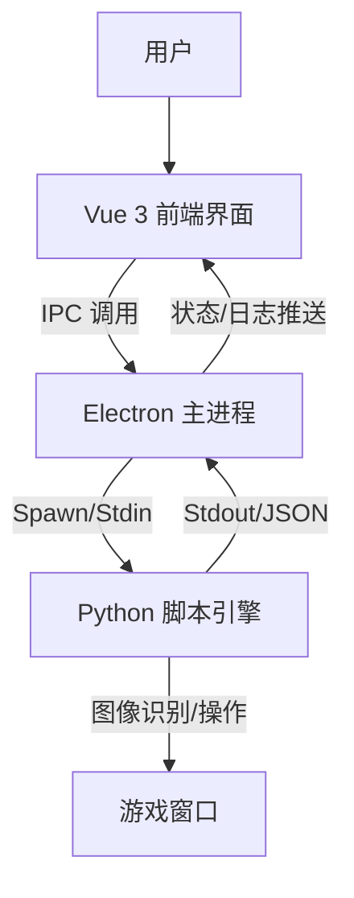

# Duet Night Abyss Automator (DNA-Auto)

这是一个基于 **Electron** + **Vue 3** + **Python** 的自动化游戏辅助工具。它通过现代化的前端界面提供极其便捷的操作体验，底层利用 Python 强大的图像识别能力实现游戏自动化功能。

## ✨ 主要功能 (Features)

1.  **现代化 UI 界面**: 基于 Vue 3 构建，提供流畅的操作体验和可视化配置。
2.  **智能监控**: 内置全局状态机，自动检测游戏窗口存在与状态。
3.  **脚本引擎**: 强大的 Python 后端，支持图像识别 (OpenCV) 和 自动化操作。
4.  **实时日志**: 前端实时展示运行日志，方便调试和监控脚本行为。
5.  **安全隔离**: 基于 Electron 多进程架构，确保脚本运行稳定。

## 🛠 技术栈 (Tech Stack)

| 模块 | 技术选型 | 说明 |
| :--- | :--- | :--- |
| **Shell** | Electron | 跨平台桌面应用容器 |
| **Frontend** | Vue 3, TypeScript, Vite | 高性能 UI 开发 |
| **UI Framework** | Naive UI (拟定) | 现代化的 Vue 3 组件库 |
| **State Mgmt** | Pinia | 全局状态管理 |
| **Backend** | Python 3 | 核心逻辑与图像处理 |
| **Libs** | OpenCV, PyAutoGUI | 图像识别与模拟操作 |

## 🏗 架构设计 (Architecture)



## 🚀 快速开始 (Getting Started)

### 开发环境要求
- Node.js (v18+)
- Python (v3.10+)
- pip (Python 包管理)

### 安装依赖

```bash
# 前端依赖
npm install

# Python 依赖
pip install -r py_engine/requirements.txt
```

### 启动开发

```bash
npm run dev
```

这将同时启动 Vite 开发服务器、Electron 主进程窗口以及 Python 脚本监听。

## 📋 项目状态 (Project Status)

### ✅ 已完成功能
- [x] Electron + Vue 3 基础架构搭建
- [x] Preload 脚本正确配置,实现安全的 IPC 通信
- [x] Python 引擎启动和进程管理
- [x] 前后端数据通信管道(Electron ↔ Python)
- [x] 实时日志显示系统
- [x] 基础 UI 界面(使用 Naive UI)

### 🚧 开发中
- [ ] 游戏窗口检测功能
- [ ] 图像识别脚本引擎
- [ ] 自动化操作逻辑
- [ ] 配置管理系统

## 🔧 已解决的问题 (Resolved Issues)

### Issue #1: electronAPI 未定义
**问题描述**: 前端调用 `window.electronAPI` 时报错 `undefined`

**根本原因**: 
1. `electron/main.ts` 缺少应用启动代码(`app.whenReady()`)
2. 窗口未被创建,导致 preload 脚本未加载

**解决方案**:
1. 添加 `app.whenReady()` 监听器
2. 在应用就绪时调用 `createWindow()` 和 `startPythonEngine()`
3. 添加必要的 IPC 处理器(如 `ping`)

## 🎯 下一步计划 (Next Steps)
1. 实现游戏窗口检测功能
2. 开发 Python 端的图像识别模块
3. 设计脚本配置系统
4. 实现自动化操作流程